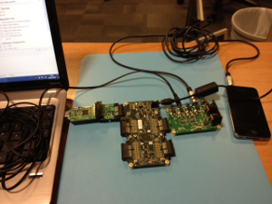

.. |i2c| replace:: I |-| :sup:`2` |-| C

SCI2C xSOFTip Component
=======================

.. xsoftip:: SCI2C
   :version: 2.0.1

SCI2C xSOFTip Component
-----------------------

A software defined, industry-standard, |i2c| component
that allows you to control an |i2c| bus via the
xCORE GPIO hardware-response ports. |i2c| is a two-wire hardware serial
interface, first developed by Philips. This component is controlled
via C using the XMOS multicore extensions and can either act as |i2c| master or slave.

The component can be used by multiple tasks within the xCORE device
and (each addressing the same or different slaves) and
is compatible with other slave devices on the same bus.

Features
........

 * |i2c| master and |i2c| slave modes.
 * Supports speed of 100 Kb/s or 400 Kb/s.
 * Multiple master support.
 * Clock stretching support.

Configurations
..............

 * |i2c| master
 * |i2c| master using a single port block (reading not supported)
 * |i2c| slave

Resource Usage
..............

.. list-table::
   :header-rows: 1
   :class: wide vertical-borders horizontal-borders

   * - Configuration
     - Pins
     - Port Blocks
     - Clock Blocks
     - Ram
     - Logical cores
   * - Master
     - 2
     - 2 x 1-bit
     - 0
     - ~1.2k
     - 0 :sup:`1`
   * - Master (multi-master disabled)
     - 2
     - 2 x 1-bit
     - 0
     - ~0.9k
     - 0 :sup:`1`
   * - Master (single port)
     - 2
     - 1 x {4,8,16 or 32}-bit
     - 0
     - ~1.1k
     - 0 :sup:`1`
   * - Slave
     - 2
     - 2 x 1-bit
     - 0
     - ~1.5k
     - 1

:sup:`1` By default the |i2c| master mode configurations do not take any
logical cores but execute in place on the core that uses
them. However, if the component is placed on a different tile to the
task using it then it will require as task to be placed on a core of
its own (possible combined with other tasks).

Hardware characteristics
------------------------

The |i2c| protocol requires two wires to be connected to the xCORE
device: a clock line and data line as shown in
:ref:`i2c_wire_table`. Both lines can be bi-directional and of
open-drain design.

.. _i2c_wire_table:

.. list-table:: I2C data wires
     :class: vertical-borders horizontal-borders

     * - *SDA*
       - Data line that transmits data in both directions.
     * - *SCL*
       - Clock line, usually driven by the master unless clock
         stretching is enabled.

Master configuration
....................

.. _i2c_master_mode_hw_diag:

.. figure:: images/i2c-master-schem-crop.pdf
   :width: 50%

   External connections in master configuration

When using the component in master mode it can be configured in normal
or single-port mode. In single-port mode reading from the bus is not
supported. In normal mode the xCORE should be connected as shown in
:ref:`i2c_master_mode_hw_diag`. In single-port mode
the xCORE should be connected as shown in
:ref:`i2c_master_mode_hw_sp_diag`. 
In both cases, the SCL and SDA lines require 1K pull-up resistors be
present.

.. _i2c_master_mode_hw_sp_diag:

.. figure:: images/i2c-master-schem-sp-crop.pdf
   :width: 50%

   External connections in master configuration (single port)

Slave configuration
....................

When using the component in slave mode the xCORE should be connected as shown in
:ref:`i2c_slave_mode_hw_diag`. The SCL and SDA lines require 1K
pull-up resistors be present.

.. _i2c_slave_mode_hw_diag:

.. figure:: images/i2c-master-schem-crop.pdf
   :width: 50%

   External connections in slave configuration

Evaluation platform
...................

This module may be evaluated using the sliceKIT Modular Development
Platform, available from digikey. The following SKUs will allow you to
test the component in master mode against the |i2c| controlled audio
codec on the XA-SK-AUDIO slice:

   * XP-SKC-L16 (sliceKIT L16 Core Board)
   * XA-SK-AUDIO
   * XA-SK-XTAG2 (sliceKIT xTAG adaptor)
   * xTAG-2 (debug adaptor)

Quickstart
----------

To quickly see the functionality of the |i2c| component, a demo is
provided that queries a register of an audio codec over the |i2c| bus.

Hardware setup
..............

To setup the hardware:

    #. Connect the XA-SK-AUDIO slice card to the XP-SKC-L16 sliceKIT Core Board using the connector marked with the ``CIRCLE``. 
    #. Connect the XTAG-2 USB debug adaptor to the XP-SKC-L16 sliceKIT Core Board (via the supplied adaptor board)
    #. Connect the XTAG-2 to host PC (as USB extension cable can be used if desired)
    #. Connect the power supply to the XP-SKC-L16 sliceKIT Core Board

   Hardware setup for I2C demo using the XA-SK-AUDIO slice

Importing and building the demo application
...........................................

To build the demo application:

   #. Open xTIMEcomposer and open the edit perspective (Window->Open Perspective->XMOS Edit).
   #. Locate the ``I2C Master Demo`` item in the xSOFTip pane on the bottom left of the window and drag it into the Project Explorer window in the xTIMEcomposer. This will also cause the modules on which this application depends (in this case, module_i2c_master) to be imported as well.
   #. Click on the ``app_i2c_demo`` item in the Explorer pane then click on the build icon (hammer) in xTIMEcomposer. Check the console window to verify that the application has built successfully.

Note that the Developer Column in the xTIMEcomposer on the right hand side of your screen provides information on the xSOFTip components you are using. Select the module_i2c component in the Project Explorer, and you will see its description together with API documentation. Having done this, click the `back` icon until you return to this quickstart guide within the Developer Column.

For help in using xTIMEcomposer, try the xTIMEcomposer tutorial (See Help->Tutorials in xTIMEcomposer).

Running the demo
................

Now that the application has been compiled, the next step is to run it on the sliceKIT Core Board using the tools to load the application over JTAG (via the xTAG2 and xTAG Adaptor card) into the xCORE multicore microcontroller.

   #. Click on the ``Run`` icon (the white arrow in the green circle).   A dialog will appear asking which device to connect to. Select ``XMOS XTAG2``.
   #. The application will then output information to the console
      window with data read over the |i2c| bus and then stop running.

Next steps
..........

   #. Examine the source of the demo program (``main.xc``) to see how
      the |i2c| component is instantiated and used.
   #. Review the |i2c| component API.

Master API
----------

All |i2c| master functions can be accessed via the ``i2c.h`` header::

  #include <i2c.h>

You will also have to add ``module_i2c`` to the
``USED_MODULES`` field of your application Makefile.

|i2c| master components are instantiated as parallel tasks that run in a
``par`` statement. The application can connect via an interface
connection.

.. figure:: images/task_diag-crop.pdf

   I2C task diagram

For example, the following code instantiates an |i2c| master component
and connect to it::

  port p_scl = XS1_PORT_4C;
  port p_sda = XS1_PORT_1G;
   
  int main(void) {
    i2c_master_if i2c[1];
    par {
      i2c_master(i2c, 1, p_scl, p_sda, 100, I2C_ENABLE_MULTIMASTER);
      my_application(i2c[0]);
    }
    return 0;
  }

Note that the connection is an array of interfaces, so several tasks
can connect to the same component instance.

Creating an I2C master instance
...............................

.. doxygenfunction:: i2c_master
.. doxygenfunction:: i2c_master_single_port

|newpage|

I2C master interface
.....................

.. doxygenenum:: i2c_write_res_t

.. doxygeninterface:: i2c_master_if

Slave API
---------

All |i2c| slave functions can be accessed via the ``i2c.h`` header::

  #include <i2c.h>

You will also have to add ``module_i2c`` to the
``USED_MODULES`` field of your application Makefile.

|i2c| slave components are instantiated as parallel tasks that run in a
``par`` statement. The application can connect via an interface
connection.

.. figure:: images/task_diag-crop.pdf

   I2C task diagram

For example, the following code instantiates an |i2c| slave component
and connect to it::

  port p_scl = XS1_PORT_4C;
  port p_sda = XS1_PORT_1G;
   
  int main(void) {
    i2c_slave_if i2c;
    par {
      i2c_slave(i2c, p_scl, p_sda, 0x3b, 2);
      my_application(i2c);
    }
    return 0;
  }

The slave component acts as the client of the interface
connection. This means it can "callback" to the application to respond
to requests from the bus master. For example, the ``my_application``
function above needs to respond to the calls e.g.::

  void my_application(server i2c_slave_if i2c)
  {
    while (1) {
      select {
      case i2c.master_performed_write(uint8_t data[n], size_t n):
         // handle write to device here
         ...
         break;
      case i2c.master_requests_read(uint8_t data[n], size_t n):
         // handle read from device here
         ...
         break;
      }
    }
  }

Creating an I2C slave instance
..............................

.. doxygenfunction:: i2c_slave

I2C slave interface
...................

.. doxygeninterface:: i2c_slave_if
